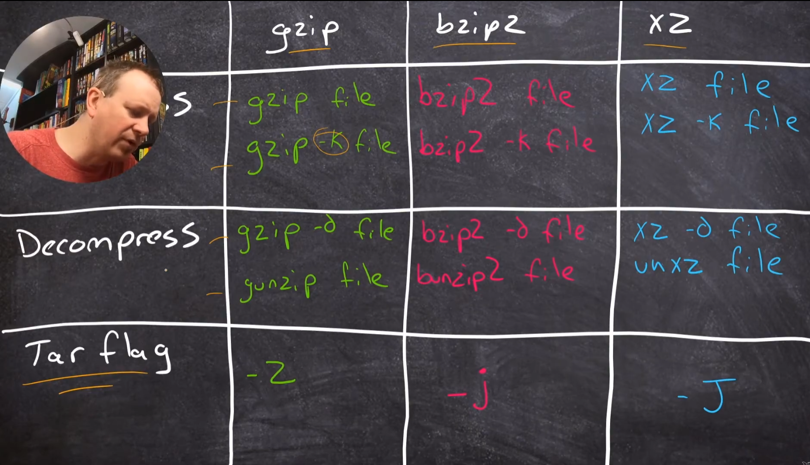

## Introduction

[Linux Essentials - the MOST Important Certificate](https://www.youtube.com/watch?v=skTShEHyXfo&list=PL78ppT-_wOmvlYSfyiLvkrsZTdQJ7A24L&index=1)

## WHAT IS LINUX AND WHAT IS A DISTRO ?
[WHAT IS LINUX AND WHAT IS A DISTRO ?](https://www.youtube.com/watch?v=meAGfhD3_ww&list=PL78ppT-_wOmvlYSfyiLvkrsZTdQJ7A24L&index=2)

Windows and MacOS are OS, but in Linux there is two different things:
- the kernel, which is Linux. Basicaly the OS heart.
- the distribution (or distro), which is basicaly the GUI.

#### Where Linux live ?

Linux run on a multitudes of machines:
- PC(desktop, server, laptop)
- embedded (kindle, android mobile phone)
- Raspberry Pi
- Cloud (Underneath, Instances, Services)
---
### There is a lot of different distributions in Linux:

#### Debian based:
- Ubuntu (and variants)
- any ".deb" based systems

#### RedHat based:
- RHEL (RedHat Enterprise Linux)
- Fedora
- Cent OS
- "RPM" based systems

#### Other:
- Arch
- Slackware
- SUSE
- Android
- Embedded systems

## WHAT APPLICATION WORK IN LINUX ?
[WHAT APPLICATION WORK IN LINUX ?](https://www.youtube.com/watch?v=LH0FhfuQado&list=PL78ppT-_wOmvlYSfyiLvkrsZTdQJ7A24L&index=3)

We can install many applications on a Linux machine, and a lot of server application like MySQL, Apache...

### There is also a lot of languages available on Linux:
- C
- C++
- Java
- Javascript
- PERL
- BASH
- Python
- PHP
- Rust
- Golang
- most of the programming language are available on Linux

It's easy and free to install most of the applications on Linux.

## DON'T FEAR OPEN SOURCE LICENSING...
[DON'T FEAR OPEN SOURCE LICENSING...](https://www.youtube.com/watch?v=x_U9Rkc3TmI&list=PL78ppT-_wOmvlYSfyiLvkrsZTdQJ7A24L&index=4)

Open source is freedom to: 
- Use code
- Share code
- Modify code

Open source are Copyleft (can you something), which is the inverse of Copyright (can't use something)

FLOSS: Free/Libre and Open Source Software  
FOSS: Free and Open Source Software

They're basicaly the same, use FLOSS, it's most clear.

FSE: Free Softwate Fundation
- Original (old one)
- GNU

OSI: Open Source Initiative
- More buisness friendly
- Allows more licenses

FSE and OSI are basicaly the same.

#### Permissive:
Anybody can take the source code and use it for whatever they want, they can:
- Wrap it inside ther own little program and they don't need to share the source code
- Sell the program that they made for money

Type of permissive licenses:
- MIT
- BSD
- Apache

#### Copyleft:
You can use the source code but you have to give away and made available any of the source code that you write that includes the open source that you're using.

Type of restrictive licenses:
- GPL 2
- GPL 3
- AGPL 3

#### Between permissive and restrictive liscence:
- MPL2.0
- LGPL 3

#### Conclusion:
It's extremely important to know what specific license a piece of open source that you use is licenses uder.  
If it DOESN'T have any license attached to it, it's copyrighted.

There is over 200 different open source licenses.

### NON-Software ?

Photos, musics, videos... can be licensed under CREATIVE COMMONS which is an open sort of license for this type of things.

For some licenses that are creative commons, you could :
- have to attribute who originally made the photo, music or video
- can't use it if you're going to sell it
- can use it but can't modify it

### Buisness model

- Paid support model (Original way)
- Pro Features model: not release all features
- Paid content: like youtube

## Doing Things with Linux
[Doing Things with Linux](https://www.youtube.com/watch?v=ou9stJYm4j0&list=PL78ppT-_wOmvlYSfyiLvkrsZTdQJ7A24L&index=6)

## DESTROY Command Line Paralysis: Master Simple CLI Tools
[DESTROY Command Line Paralysis: Master Simple CLI Tools](https://www.youtube.com/watch?v=UuJuq5wubaU&list=PL78ppT-_wOmvlYSfyiLvkrsZTdQJ7A24L&index=8)

#### LINUX IS CASE SENSITIVE !

### Navigating in files systeme

#### Get the files and folders in your directory:

You can combine parameters (ie. -al or -la)

- base: ls
- all files (hidden files too): ls -a
- detailed list: ls -l
    - if the line start with a "d": directory
- recursive listing: -R
- get list of a certain folder: ls (-a -l ...) "foldername"
    - works with editing too
- search name: ls \*"searchname"\*
    - \* is used to say "anything here"

#### Change Directory:
- classic: cd "target directory"
- parent directory: cd ..
- home directory: cd ~    or cd
  
Folder "." : current directory  
Folder "..": parent directory

#### Get absolute path of the current directory: pwd

#### Edit files and directories
- remove file: rm "filename"
    - can also remove folder if recursive: rm -R "foldername"
- create empty file: touch "filename"
- remove folder: rmdir "foldername"
    - can only remove EMPTY directory
- create folder: mkdir "foldername"
- copy file: cp "filename" "new filename"
- move file: mv "filename" "foldername destination"
- rename file: mv "filename" "new filename"

## You NEED to Know The Linux CLI!
[You NEED to Know The Linux CLI!](https://www.youtube.com/watch?v=N-qRMeXkDIw&list=PL78ppT-_wOmvlYSfyiLvkrsZTdQJ7A24L&index=7)

cmd in Linux is in bash (Born Against SHell)

#### Get all commands: ls /bin

#### Get the type is an commande/name: type "commande/name"
- (ie. type ls will explain what did ls mean)
#### Where did the commaande come from: which "command"
- (ie. which ls: /usr/bin/ls)
#### Show all variables set in a bash terminal
- one of this varibles is PATH
    - a commande is executed only if it is in the PATH
#### Create new variable: "variable name"="variable content"
- (ie. THING=something)
#### Use created variable: $"variable name"
- (ie. "echo $THING" will return "something")
#### Import variables inside a new bash terminal: export "variable name"
#### Start a new bash terminal (inside another one): bash
#### Exit a bash terminal: exit
#### Get histrory: history
- clear history: history -c

## Need Linux Help? JUST ASK LINUX!
[Need Linux Help? JUST ASK LINUX!](https://www.youtube.com/watch?v=tDfSbs7DhsM&list=PL78ppT-_wOmvlYSfyiLvkrsZTdQJ7A24L&index=8)

### Way to get help:
#### man pages (manual pages)
- built in
- informative
- got replace by info
- (ie. man "cmd")
#### info
- less common
- newer than man
    - look like man
- (ie. info "cmd")
#### less
- for viewing files in /usr/share/doc
- (ie. less "filename")
#### -h
- doesn't always work
    - sometime: --help
- (ie. '"cmd" --help' or '"cmd" -h)
#### Google
- that's not a command, search on google (cannot during exams)
- "cmd" manpage

## Linux Does So Much More than ZIP!
[Linux Does So Much More than ZIP!](https://www.youtube.com/watch?v=2cPRvL0TOjE&list=PL78ppT-_wOmvlYSfyiLvkrsZTdQJ7A24L&index=9)

#### Create a tar file
- tar files are archives files
- cmd: tar -c -f archive.tar A_Folder_of_Stuff/
    - **tar** commande name and the type of the file
    - **-c** is for create
    - **-f** for the name of the created file
    - **archive.tar** is the filename
    - **A** _ **Folder** _ **of** _ **Stuff/** is the content we want to put in the tar file

#### Extract from a tar file
- tar -x -f archive.tar
    - **-x** mean extract

#### First ligne/first column is: Compress

### Compress on Linux

#### gzip
- (Good Zip)
- "gzip -k archive.tar"
- **-k** means keep the original, don't delete the non-compressed file

#### bzip2
- (Better Zip)
- "bzip2 -k archive.tar"
#### xz
- (Extra good Zip)
- "xz -k archive.tar"

### Decompress on Linux

#### gzip
- (Good Zip)
- "gzip -d archive.tar.gz" or "gunzip archive.tar.gz"
- **-d** means decompress
- it delete the compressed file after

#### bzip2
- (Better Zip)
- "bzip2 -d archive.tar.bz2" or "bunzip2 archive.tar.bz2"
- it delete the compressed file after

#### xz
- (Extra good Zip)
- "xz -d archive.tar.xz" or "unxz archive.tar.xz"
- it delete the compressed file after

### Using tar (Compress and Decompress)

tar don't compress, it just call the others commands

#### With gzip
##### Compress
- "tar -c -z -f archive.tar.gz A_Folder_of_Stuff/" or "tar -c -z -f archive.tgz A_Folder_of_Stuff/"
    - **-c** for create
    - **-z** call gzip
        - use gzip to compress the tar file

##### Decompress
- "tar -x -z archive.tgz"
    - **-x** for extract
    - **-z** call gzip
        - use gzip to decompress the tar file

#### With bzip2
##### Compress
- "tar -cjf archive.tar.bz2 A_Folder_of_Stuff/" or "tar -cjf archive.tbz A_Folder_of_Stuff/"
    - can combine letters
        - make sure f is the last one because it requires an argument (filename)
    - **-j** call bzip2
        - use bzip2 to compress the tar file

##### Decompress
- "tar -x -j archive.tgz"
    - **-j** call bzip2
        - use bzip2 to decompress the tar file

#### With xz
##### Compress
- "tar -c -J -f archive.tar.xz A_Folder_of_Stuff/" or "tar -c -J -f archive.txz A_Folder_of_Stuff/"
    - **-J** call xz to compress the tar file

##### Decompress
- "tar -x -J archive.txz"
    - **-J** call xz
        - use xz to decompress the tar file

### Using Zip and Unzip

#### Zip
- "zip -R archive.zip A_Folder_of_Stuff/"
    - **-R** for recursive
        - needed, else it wil compress omly the folder and nothing inside it

#### Unzip
- "unzip archive.zip"

## Linux PIPES and REDIRECTS: Command Line Ninja Skillz
[Linux PIPES and REDIRECTS: Command Line Ninja Skillz](https://www.youtube.com/watch?v=Kdr0OrCPtyk&list=PL78ppT-_wOmvlYSfyiLvkrsZTdQJ7A24L&index=10)

An application have:
- a standart input (stdin)
    - to send informations into application when you run it
- a standar output (stdout)
    - output of the application
- a standar error (stderr)
    - utput of all the errors of the application

By default, stdout and stderr dump directly to the terminal, but can be redirected (ie. to a file).

### Exemple

#### echo "hello"
- print "hello" in the terminal window
- print the errors in the terminal window

#### echo "hello" > output.txt
- print "hello" in the file output.txt
    - if no file found, create one
- print the errors in the terminal window

#### echo "hello" 2> error.txt
- print "hello" in the terminal window
- print the errors in the file error.txt
    - if no file found, create one

#### echo "hello" > output.txt 2>&1
- print "hello" in the file output.txt
- print the errors in the file output.txt

#### echo "hello" >> output.txt
- print "hello" in the file output.txt
- print the errors in the terminal window
- will extend the file output.txt
    - will not errase the olders lines in the file

#### Recap
- **1** is the stdout
- **2** is the stderr
- **a > b** will replace the file b by the stdout of a
- **a 2> b** will replace the file b by the stderr of a
- **a >> b** will extend the file b with the stdout of a
- **2>&1** will redirect the stderr into the stdout

#### Read a file in the terminal window
- cat output.txt | less
    - **cat** is the command to read a file in the terminal
    - **output.txt** is the filename
    - **|** is used to change the stdin:
        - "a | b"
            - a is the stdin of b
    - less is a commande to have a better view of a file in the terminal window
- cat output.txt 2>&1 | less
    - **2>&1** will assure that if we made a mistake like "ouptut.txt (which not exist)" it will print the error in the less command

## Linux RULES at Text Manipulation. [BONUS: Basic REGEX]
[Linux RULES at Text Manipulation. [BONUS: Basic REGEX]](https://www.youtube.com/watch?v=OTUMj3byfCA&list=PL78ppT-_wOmvlYSfyiLvkrsZTdQJ7A24L&index=12)

### Making multiple commands at the same time
    command1; command2; command3 ...

### Read just top or bottom of a file

#### Top
- head -n 5 file.csv
    - **head** mean the top of the file
    - **-n** is for a certain number of lines
        - **5** is the number of lines
    - **file.csv** is the filename

#### Bottom
- tail -n 3 file.csv
    - **tail** mean bottom

##### By default "head" and "tail" return 10 lines.

- tail -n +2 file.csv
    - **+2** here mean that the command will return everything starting at the second line

- head -n -2 file.csv
    - **-2** here mean that the command will return everything from the start to the end exept the last line

- sort file.csv
    - will sort every lines alphabetically

### Composition of commands
    head -n 1 file.csv; tail -n +2 file.csv | sort
- head -n 1 file.csv
    - return the first line
- tail -n +2 file.csv | sort
    - return everything exept the first line and sort it
    - we can add **-r** after **sort** toreverse the sorting

### cut function
    cut -c 1-3 file.csv
- **cut** will cut each line of the file **file.csv**
- **-c** is the **cut** parameters and it's for a character cut
- **1-3** mean that it will cut the characters from the first one to the third one of each lines
- **file.csv** is the filename

#### cut -d, -f 2 file.csv
- **-d,** mean it will use the comma as a delimiter
- **-f** is for what field we want
- **2** is the field number that we want
- the command will return the field between  the first and the second comma of each line

### Grep command
    grep "red" file.csv
- **grep** is a coomand that return each line that contain a certain sentence
- **"red"** is the searched sentence
- **file.csv** is the filename

#### grep is case sensitive
- **-i** delete the case sensitivity of tf the grep command
    - (ie. **grep -i "RED" file.csv**)

#### grep "ap[pe]" file.csv
- mean that it will return everything is the brackets:
    - **app** or **ape**

#### grep ".ap" file.csv
- the dot mean every characters
    - (ie. rap, sap, jap, aap ...)
    - it has to be a character#
        - (ie. not just ap or ,ap ...)

#### grep "ap*l" file.csv
- the star mean that the previous character can be multiple time or none
    - (ie. appl, al, apl, appppppl ...)

#### grep -E "el?o" file.csv
- **-E** is for edge
- **?** mean that the previous character has to existe 0 or 1 time
    - (ie. elo or eo, but not ello)

#### wc -l file.csv
- **wc** mean words count
- **-l** is for the number of lines
- (ie. **grep "red" file.csv | wc -l**)