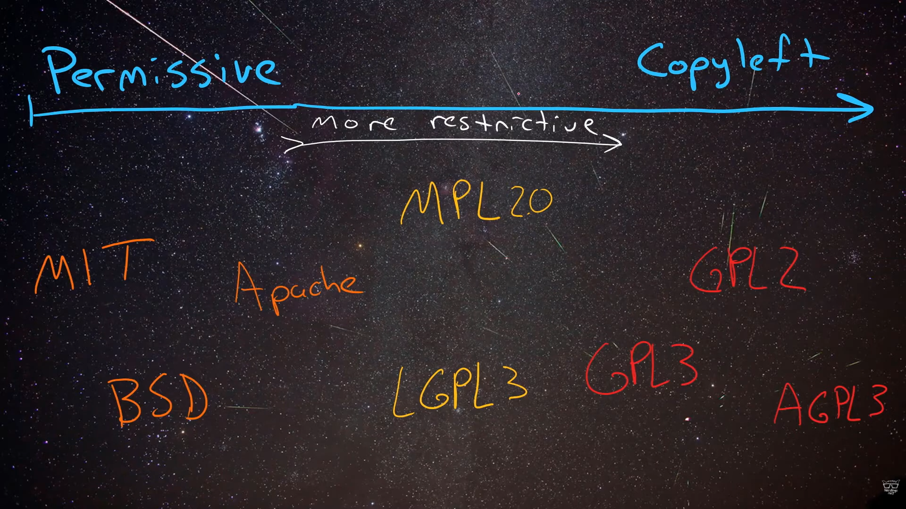

[Linux Essentials - the MOST Important Certificate](https://www.youtube.com/watch?v=skTShEHyXfo&list=PL78ppT-_wOmvlYSfyiLvkrsZTdQJ7A24L&index=1)

## WHAT IS LINUX AND WHAT IS A DISTRO ?
[WHAT IS LINUX AND WHAT IS A DISTRO ?](https://www.youtube.com/watch?v=meAGfhD3_ww&list=PL78ppT-_wOmvlYSfyiLvkrsZTdQJ7A24L&index=2)

Windows and MacOS are OS, but in Linux there is two different things:
- the kernel, which is Linux. Basicaly the OS heart.
- the distribution (or distro), which is basicaly the GUI.

#### Where Linux live ?

Linux run on a multitudes of machines:
- PC(desktop, server, laptop)
- embedded (kindle, android mobile phone)
- Raspberry Pi
- Cloud (Underneath, Instances, Services)
---
### There is a lot of different distributions in Linux:

#### Debian based:
- Ubuntu (and variants)
- any ".deb" based systems

#### RedHat based:
- RHEL (RedHat Enterprise Linux)
- Fedora
- Cent OS
- "RPM" based systems

#### Other:
- Arch
- Slackware
- SUSE
- Android
- Embedded systems

## WHAT APPLICATION WORK IN LINUX ?
[WHAT APPLICATION WORK IN LINUX ?](https://www.youtube.com/watch?v=LH0FhfuQado&list=PL78ppT-_wOmvlYSfyiLvkrsZTdQJ7A24L&index=3)

We can install many applications on a Linux machine, and a lot of server application like MySQL, Apache...

### There is also a lot of languages available on Linux:
- C
- C++
- Java
- Javascript
- PERL
- BASH
- Python
- PHP
- Rust
- Golang
- most of the programming language are available on Linux

It's easy and free to install most of the applications on Linux.

## DON'T FEAR OPEN SOURCE LICENSING...
[DON'T FEAR OPEN SOURCE LICENSING...](https://www.youtube.com/watch?v=x_U9Rkc3TmI&list=PL78ppT-_wOmvlYSfyiLvkrsZTdQJ7A24L&index=4)

Open source is freedom to: 
- Use code
- Share code
- Modify code

Open source are Copyleft (can you something), which is the inverse of Copyright (can't use something)

FLOSS: Free/Libre and Open Source Software  
FOSS: Free and Open Source Software

They're basicaly the same, use FLOSS, it's most clear.

FSE: Free Softwate Fundation
- Original (old one)
- GNU

OSI: Open Source Initiative
- More buisness friendly
- Allows more licenses

FSE and OSI are basicaly the same.

#### Permissive:
Anybody can take the source code and use it for whatever they want, they can:
- Wrap it inside ther own little program and they don't need to share the source code
- Sell the program that they made for money

Type of permissive licenses:
- MIT
- BSD
- Apache

#### Copyleft:
You can use the source code but you have to give away and made available any of the source code that you write that includes the open source that you're using.

Type of restrictive licenses:
- GPL 2
- GPL 3
- AGPL 3

#### Between permissive and restrictive liscence:
- MPL2.0
- LGPL 3

#### Conclusion:
It's extremely important to know what specific license a piece of open source that you use is licenses uder.  
If it DOESN'T have any license attached to it, it's copyrighted.

