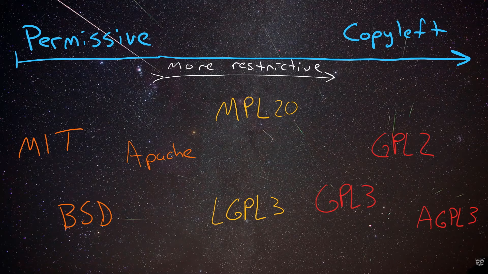
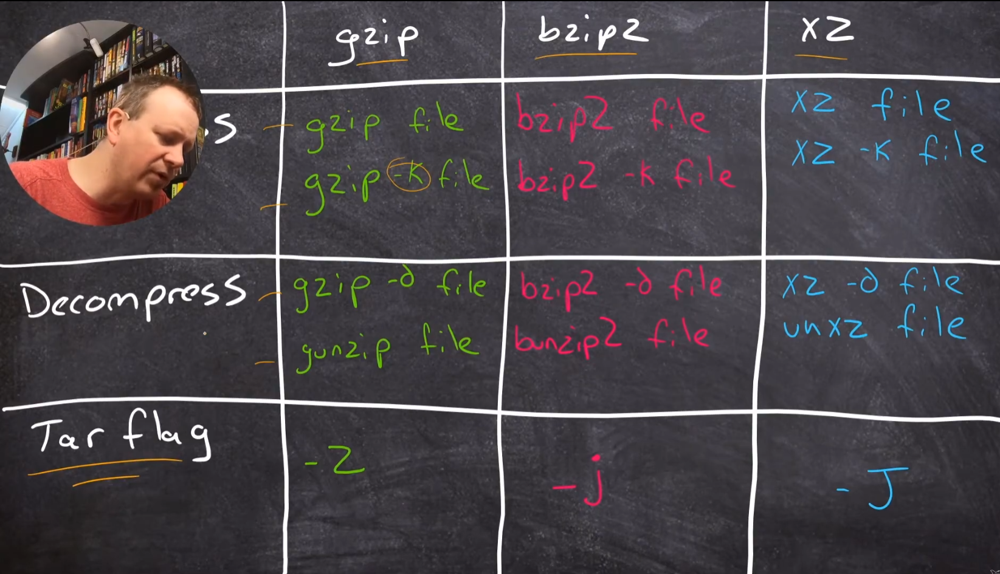
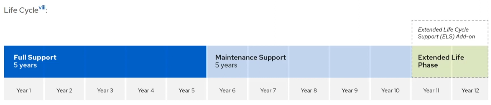
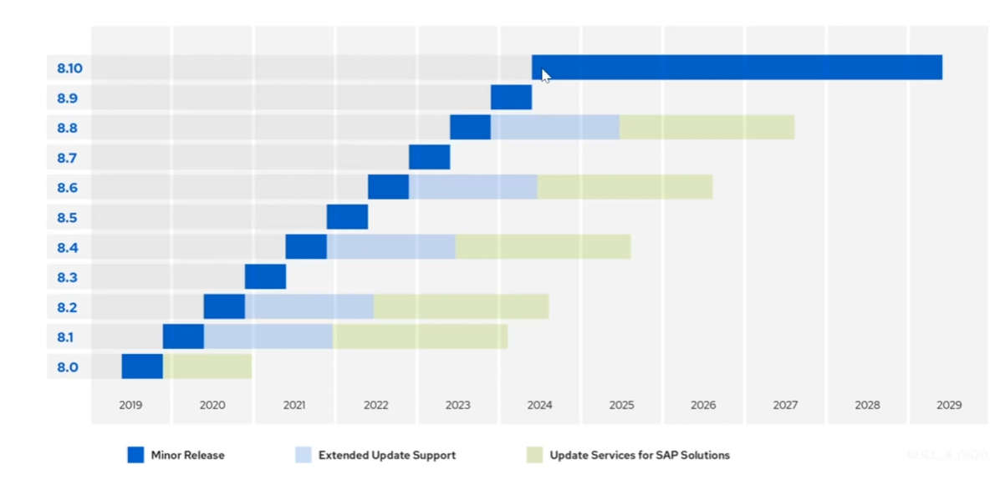
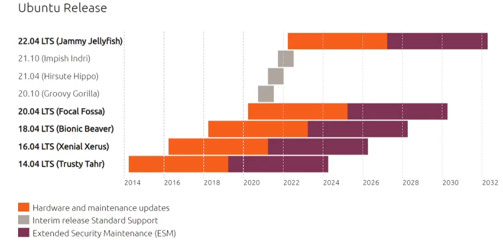
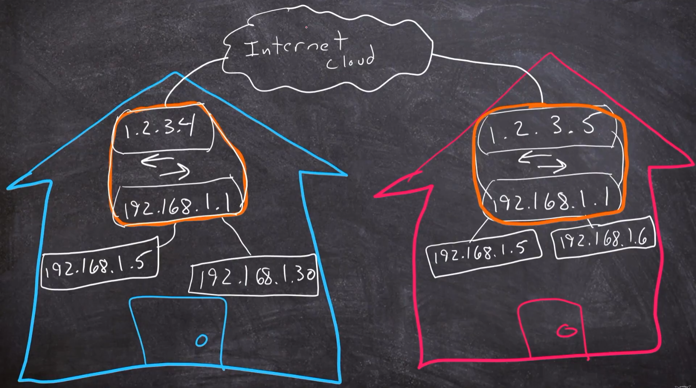
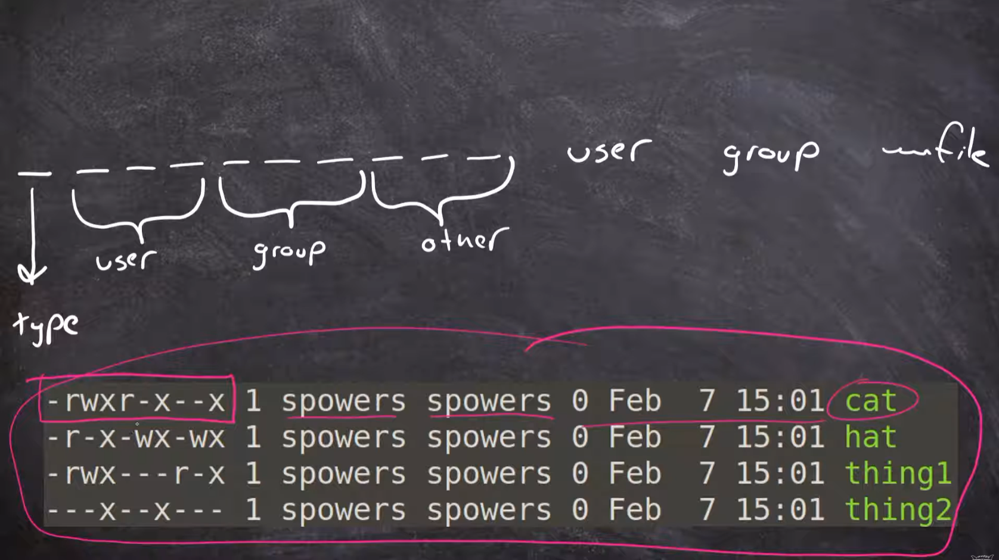

# Introduction

[Linux Essentials - the MOST Important Certificate](https://www.youtube.com/watch?v=skTShEHyXfo&list=PL78ppT-_wOmvlYSfyiLvkrsZTdQJ7A24L&index=1)

# WHAT IS LINUX AND WHAT IS A DISTRO ?
[WHAT IS LINUX AND WHAT IS A DISTRO ?](https://www.youtube.com/watch?v=meAGfhD3_ww&list=PL78ppT-_wOmvlYSfyiLvkrsZTdQJ7A24L&index=2)

Windows and MacOS are OS, but in Linux there is two different things:
- the kernel, which is Linux. Basicaly the OS heart.
- the distribution (or distro), which is basicaly the GUI.

### Where Linux live ?

Linux run on a multitudes of machines:
- PC(desktop, server, laptop)
- embedded (kindle, android mobile phone)
- Raspberry Pi
- Cloud (Underneath, Instances, Services)
---
## There is a lot of different distributions in Linux:

### Debian based:
- Ubuntu (and variants)
- any ".deb" based systems

### RedHat based:
- RHEL (RedHat Enterprise Linux)
- Fedora
- Cent OS
- "RPM" based systems

### Other:
- Arch
- Slackware
- SUSE
- Android
- Embedded systems

# WHAT APPLICATION WORK IN LINUX ?
[WHAT APPLICATION WORK IN LINUX ?](https://www.youtube.com/watch?v=LH0FhfuQado&list=PL78ppT-_wOmvlYSfyiLvkrsZTdQJ7A24L&index=3)

We can install many applications on a Linux machine, and a lot of server application like MySQL, Apache...

## There is also a lot of languages available on Linux:
- C
- C++
- Java
- Javascript
- PERL
- BASH
- Python
- PHP
- Rust
- Golang
- most of the programming language are available on Linux

It's easy and free to install most of the applications on Linux.

# DON'T FEAR OPEN SOURCE LICENSING...
[DON'T FEAR OPEN SOURCE LICENSING...](https://www.youtube.com/watch?v=x_U9Rkc3TmI&list=PL78ppT-_wOmvlYSfyiLvkrsZTdQJ7A24L&index=4)

Open source is freedom to: 
- Use code
- Share code
- Modify code

Open source are Copyleft (can you something), which is the inverse of Copyright (can't use something)

FLOSS: Free/Libre and Open Source Software  
FOSS: Free and Open Source Software

They're basicaly the same, use FLOSS, it's most clear.

FSE: Free Softwate Fundation
- Original (old one)
- GNU

OSI: Open Source Initiative
- More buisness friendly
- Allows more licenses

FSE and OSI are basicaly the same.

### Permissive:
Anybody can take the source code and use it for whatever they want, they can:
- Wrap it inside ther own little program and they don't need to share the source code
- Sell the program that they made for money

Type of permissive licenses:
- MIT
- BSD
- Apache

### Copyleft:
You can use the source code but you have to give away and made available any of the source code that you write that includes the open source that you're using.

Type of restrictive licenses:
- GPL 2
- GPL 3
- AGPL 3

### Between permissive and restrictive liscence:
- MPL2.0
- LGPL 3



### Conclusion:
It's extremely important to know what specific license a piece of open source that you use is licenses uder.  
If it DOESN'T have any license attached to it, it's copyrighted.

There is over 200 different open source licenses.

## NON-Software ?

Photos, musics, videos... can be licensed under CREATIVE COMMONS which is an open sort of license for this type of things.

For some licenses that are creative commons, you could :
- have to attribute who originally made the photo, music or video
- can't use it if you're going to sell it
- can use it but can't modify it

## Buisness model

- Paid support model (Original way)
- Pro Features model: not release all features
- Paid content: like youtube

# Doing Things with Linux
[Doing Things with Linux](https://www.youtube.com/watch?v=ou9stJYm4j0&list=PL78ppT-_wOmvlYSfyiLvkrsZTdQJ7A24L&index=6)

# DESTROY Command Line Paralysis: Master Simple CLI Tools
[DESTROY Command Line Paralysis: Master Simple CLI Tools](https://www.youtube.com/watch?v=UuJuq5wubaU&list=PL78ppT-_wOmvlYSfyiLvkrsZTdQJ7A24L&index=8)

### LINUX IS CASE SENSITIVE !

## Navigating in files systeme

### Get the files and folders in your directory:

You can combine parameters (ie. -al or -la)

- base: ls
- all files (hidden files too): ls -a
- detailed list: ls -l
    - if the line start with a "d": directory
- recursive listing: -R
- get list of a certain folder: ls (-a -l ...) "foldername"
    - works with editing too
- search name: ls \*"searchname"\*
    - \* is used to say "anything here"

### Change Directory:
- classic: cd "target directory"
- parent directory: cd ..
- home directory: cd ~    or cd
  
Folder "." : current directory  
Folder "..": parent directory

### Get absolute path of the current directory: pwd

### Edit files and directories
- remove file: rm "filename"
    - can also remove folder if recursive: rm -R "foldername"
- create empty file: touch "filename"
- remove folder: rmdir "foldername"
    - can only remove EMPTY directory
- create folder: mkdir "foldername"
- copy file: cp "filename" "new filename"
- move file: mv "filename" "foldername destination"
- rename file: mv "filename" "new filename"

# You NEED to Know The Linux CLI!
[You NEED to Know The Linux CLI!](https://www.youtube.com/watch?v=N-qRMeXkDIw&list=PL78ppT-_wOmvlYSfyiLvkrsZTdQJ7A24L&index=7)

cmd in Linux is in bash (Bourne Again SHell)

```
ls /bin
```
- get all the commands 

```
type "commande"
```
- get the type of a commande
    - (ie. **type ls** will explain what did ls mean)

```
which "command"
```
- get where the commande come from
    - (ie. **which ls: /usr/bin/ls**)

```
env
```
- show all variables set in a bash terminal
    - one of this varibles is PATH
        - a commande is executed only if it is in the PATH

```
"variable name"="variable content"
```
- create new variable
    - (ie. **THING=something**)

```
$"variable name"
```
- use created variable: 
    - (ie. **echo $THING** will return **something**)

```
export "variable name"
```
- import variables inside a new bash terminal

```
bash
```
- start a new bash terminal (inside another one)

```
exit
```
- exit a bash terminal

```
history
```
- get histrory

```
history -c
```
- clear history

# Need Linux Help? JUST ASK LINUX!
[Need Linux Help? JUST ASK LINUX!](https://www.youtube.com/watch?v=tDfSbs7DhsM&list=PL78ppT-_wOmvlYSfyiLvkrsZTdQJ7A24L&index=8)

## Way to get help:
### man pages (manual pages)
- built in
- informative
- got replace by info
- (ie. **man "cmd"**)

### info
- less common
- newer than man
    - look like man
- (ie. **info "cmd"**)

### less
- for viewing files in /usr/share/doc
- (ie. **less "filename"**)

### -h
- doesn't always work
    - sometime: --help
- (ie. '**"cmd" --help'** or '**"cmd" -h**)

### Google
- that's not a command, search on google (cannot during exams)
- "cmd" manpage

# Linux Does So Much More than ZIP!
[Linux Does So Much More than ZIP!](https://www.youtube.com/watch?v=2cPRvL0TOjE&list=PL78ppT-_wOmvlYSfyiLvkrsZTdQJ7A24L&index=9)

### Create a tar file
tar files are archives files
```
tar -c -f archive.tar A_Folder_of_Stuff/
```
- **tar** commande name and the type of the file
- **-c** is for create
- **-f** for the name of the created file
- **archive.tar** is the filename
- **A_Folder_of_Stuff/** is the content we want to put in the tar file

### Extract from a tar file
```
tar -x -f archive.tar
```
- **-x** mean extract



#### First ligne/first column is: Compress

## Compress on Linux

### gzip
```
gzip -k archive.tar
```
- **-k** means keep the original, don't delete the non-compressed file
- (Good Zip)

### bzip2
```
bzip2 -k archive.tar
```
- (Better Zip)

### xz
```
xz -k archive.tar
```
- (Extra good Zip)

## Decompress on Linux

### gzip
```
gzip -d archive.tar.gz" or "gunzip archive.tar.gz
```
- **-d** means decompress
- it delete the compressed file after
- (Good Zip)

### bzip2
```
bzip2 -d archive.tar.bz2
```
or
```
bunzip2 archive.tar.bz2
```
- it delete the compressed file after
- (Better Zip)

### xz
```
xz -d archive.tar.xz
```
or
```
unxz archive.tar.xz
```
- it delete the compressed file after
- (Extra good Zip)


## Using tar (Compress and Decompress)

tar don't compress, it just call the others commands

### With gzip
#### Compress
```
tar -c -z -f archive.tar.gz A_Folder_of_Stuff/
```
or
```
tar -c -z -f archive.tgz A_Folder_of_Stuff/
```
- **-c** for create
- **-z** call gzip
    - use gzip to compress the tar file

#### Decompress
```
tar -x -z archive.tgz
```
- **-x** for extract
- **-z** call gzip
    - use gzip to decompress the tar file

### With bzip2
#### Compress
```
tar -cjf archive.tar.bz2 A_Folder_of_Stuff/
```
or
```
tar -cjf archive.tbz A_Folder_of_Stuff/
```
- can combine letters
    - make sure f is the last one because it requires an argument (filename)
- **-j** call bzip2
    - use bzip2 to compress the tar file

#### Decompress
```
tar -x -j archive.tgz
```
- **-j** call bzip2
    - use bzip2 to decompress the tar file

### With xz
#### Compress
```
tar -c -J -f archive.tar.xz A_Folder_of_Stuff/
```
or
```
tar -c -J -f archive.txz A_Folder_of_Stuff/
```
- **-J** call xz to compress the tar file

#### Decompress
```
tar -x -J archive.txz
```
- **-J** call xz
    - use xz to decompress the tar file

## Using Zip and Unzip

### Zip
```
zip -R archive.zip A_Folder_of_Stuff/
```
- **-R** for recursive
    - needed, else it wil compress omly the folder and nothing inside it

### Unzip
```
unzip archive.zip
```

# Linux PIPES and REDIRECTS: Command Line Ninja Skillz
[Linux PIPES and REDIRECTS: Command Line Ninja Skillz](https://www.youtube.com/watch?v=Kdr0OrCPtyk&list=PL78ppT-_wOmvlYSfyiLvkrsZTdQJ7A24L&index=10)

An application have:
- a standart input (stdin)
    - to send informations into application when you run it
- a standar output (stdout)
    - output of the application
- a standar error (stderr)
    - utput of all the errors of the application

By default, stdout and stderr dump directly to the terminal, but can be redirected (ie. to a file).

## Exemple

### echo "hello"
- print "hello" in the terminal window
- print the errors in the terminal window

### echo "hello" > output.txt
- print "hello" in the file output.txt
    - if no file found, create one
- print the errors in the terminal window

### echo "hello" 2> error.txt
- print "hello" in the terminal window
- print the errors in the file error.txt
    - if no file found, create one

### echo "hello" > output.txt 2>&1
- print "hello" in the file output.txt
- print the errors in the file output.txt

### echo "hello" >> output.txt
- print "hello" in the file output.txt
- print the errors in the terminal window
- will extend the file output.txt
    - will not errase the olders lines in the file

### Recap
- **1** is the stdout
- **2** is the stderr
- **a > b** will replace the file b by the stdout of a
- **a 2> b** will replace the file b by the stderr of a
- **a >> b** will extend the file b with the stdout of a
- **2>&1** will redirect the stderr into the stdout

### Read a file in the terminal window
```
cat output.txt | less
```
- **cat** is the command to read a file in the terminal
- **output.txt** is the filename
- **|** is used to change the stdin:
    - "a | b"
        - a is the stdin of b
- less is a commande to have a better view of a file in the terminal window

```
cat output.txt 2>&1 | less
```
- **2>&1** will assure that if we made a mistake like "ouptut.txt (which not exist)" it will print the error in the less command

# Linux RULES at Text Manipulation. [BONUS: Basic REGEX]
[Linux RULES at Text Manipulation. [BONUS: Basic REGEX]](https://www.youtube.com/watch?v=OTUMj3byfCA&list=PL78ppT-_wOmvlYSfyiLvkrsZTdQJ7A24L&index=12)

## Making multiple commands at the same time
```
command1; command2; command3 ...
```

## Read just top or bottom of a file

### Top
```
head -n 5 file.csv
```
- **head** mean the top of the file
- **-n** is for a certain number of lines
    - **5** is the number of lines
- **file.csv** is the filename

### Bottom
```
tail -n 3 file.csv
```
- **tail** mean bottom

#### By default "head" and "tail" return 10 lines.

```
tail -n +2 file.csv
```
- **+2** here mean that the command will return everything starting at the second line

```
head -n -2 file.csv
```
- **-2** here mean that the command will return everything from the start to the end exept the last line

```
sort file.csv
```
- will sort every lines alphabetically

## Composition of commands
```
head -n 1 file.csv; tail -n +2 file.csv | sort
```
- **head -n 1 file.csv**
    - return the first line
- **tail -n +2 file.csv | sort**
    - return everything exept the first line and sort it
    - we can add **-r** after **sort** toreverse the sorting

## cut function
```
cut -c 1-3 file.csv
```
- **cut** will cut each line of the file **file.csv**
- **-c** is the **cut** parameters and it's for a character cut
- **1-3** mean that it will cut the characters from the first one to the third one of each lines
- **file.csv** is the filename

```
cut -d, -f 2 file.csv
```
- **-d,** mean it will use the comma as a delimiter
- **-f** is for what field we want
- **2** is the field number that we want
- the command will return the field between  the first and the second comma of each line

## Grep command
```
grep "red" file.csv
```
- **grep** is a command that return each line that contain a certain sentence
- **"red"** is the searched sentence
- **file.csv** is the filename

#### grep is case sensitive
```
grep -i "RED" file.csv
```
- **-i** delete the case sensitivity of the grep command

```
grep "ap[pe]" file.csv
```
- mean that it will return everything is the brackets:
    - **app** or **ape**

```
grep ".ap" file.csv
```
- the dot mean every characters
    - (ie. rap, sap, jap, aap ...)
    - it has to be a character#
        - (ie. not just ap or ,ap ...)

```
grep "ap*l" file.csv
```
- the star mean that the previous character can be multiple time or none
    - (ie. appl, al, apl, appppppl ...)

```
grep -E "el?o" file.csv
```
- **-E** is for edge
- **?** mean that the previous character has to existe 0 or 1 time
    - (ie. elo or eo, but not ello)

```
wc -l file.csv
```
- **wc** mean words count
- **-l** is for the number of lines
- (ie. **grep "red" file.csv | wc -l**)
    - get the number of lines that contain **red** in **file.csv**

# How to Write Simple Shell Scripts!
[How to Write Simple Shell Scripts!](https://www.youtube.com/watch?v=usyzSMFfUTg&list=PL78ppT-_wOmvlYSfyiLvkrsZTdQJ7A24L&index=12)

Multiple differents editors: VI, VIM, NANO...

## VI
```
vi file.sh
```
- very powerfull
- in every Linux systems
- complicated
    - a lot of shortcut to know

## Nano
```
nano file.sh
```
- in almost every Linux systems
- very user friendly

## Editors principles

- **#**
    - add a comment
- **#!/bin/bash**
    - first line of a script
    - tell Linux to use bin/bash to execute this program

### Variable
- **VariableName="VariableContent"**
    - make a variable
- **$VariableName**
    - use a variable
- **$1**
    - turn the first argument into a variable
        - (ie. **./script.sh argument1**)
    - can make multiple arguments
        - (ie. **$1 $2** ...)
            - (ie. **./script.sh argument1 argument2**)

### For loop
```
for X in 1 2 3 4 5
do
    echo $X
done
```

### Exit status
If the exit status is 0, it means that the command was well executed.
```
echo $?
```
- return the exit status of the previous command
- **$?** is the exit status of the previous command

# Picking the BEST Operating System for Linux Pros
[Picking the BEST Operating System for Linux Pros](https://www.youtube.com/watch?v=kp4P7LfSqMM&list=PL78ppT-_wOmvlYSfyiLvkrsZTdQJ7A24L&index=13)

## Microsoft Windows
- Expensive
- Lifecycle not standard
    - usually easy to migrate
- Becoming more Linux-like
- Best for gaming

## Apple MacOS
- Unix based
    - mean the terminal is a real terminal
    - sorta
- Free, but only on Apple hardware
- Regular releases

## Linux (Multiple distributions)
- Kernel regulary updated
    - distros (distributions) handle differently
- Rolling release (debian)
    - constantly keep updating the software
- Long term support (RedHat and Ubuntu LTS)

### RedHat
- Fully supported and updated for 5 years
- Maintained for 5 more years
    - make only security opdate on the last version
- You can pay to get 2 years more of maintenance support




In redHat you can use for free their beta softwares.

### Ubuntu
- Fully supported and updated for 5 years
- Can pay for 5 more years of support
- New version every 2 years



### Linux Server
- Usually doesn't have a GUI
- Usually stable version of OS

### Linux Desktop
- Usually has a GUI
- Often updated more regulary

# Identifying (FILTHY) Hardware in a Linux System!
[Identifying (FILTHY) Hardware in a Linux System!](https://www.youtube.com/watch?v=9VH-L0Q9J1M&list=PL78ppT-_wOmvlYSfyiLvkrsZTdQJ7A24L&index=14)

Hardware of the computer

## NVME drive
```
ls nvm*
```
- see our nvme drive
- will return:
    - nvme0
        - nvme bus
    - nvme0n1
        - is the first nvme drive
    - nvme0n1p1
        - is the first partition of the drive number 1
    - nvme0n1p2
        - is the second partition of the drive number 1

## SSD drive
```
ls sd*
```
- see ourt ssd drive
- will return:
    - sda
        - first ssd drive
    - sda1
        - first partition on the first ssd drive
    - sda2
        - second partition on the first ssd drive

## Different drives
- HDD
    - Hard Disk Drive
    - old one
    - mechanic
    - slow
    - cheaper

- SSD
    - Solid State Drive
    - new one
    - flash drive (like sd card)
    - fast
    - more expensive

## Interface/ Connection
**HIGHWAY** for data tranfer.  
How does the data are transmited between the SSD and the Motherboard.  
His **connection type**.

- SATA
    - Serial AT Attachment
    - old one
    - make for hdd
    - slow for ssd
    - use cable
    - used by:
        - HDD
        - SSD SATA

- PCIe
    - Peripheral Component Interconnect Express
    - new one
    - fast
    - used by:
        - GPU
        - SSD NVMe

- USB
    - External SSD

## Protocol
**TRAFFIC RULES** for the highway (interface).  
How does the drive and the motherboard communicate.

- AHCI
    - Advanced Host Controller Interface
    - old one
    - made for HDD
    - slow
    - used by:
        - HDD
        - SSD SATA
        - SSD M.2 SATA

- NVMe
    - Non-Volatile Memory Express
    - made for:
        - SSD
        - PCIe
        - not for SATA
    - fast
    - M.2 slot on motherboard
    
## Format/ Slot
How does the SSD/HDD look like.  
His **physical form**.

- M.2 slot
    - on the motherboard
    - flat on the motherboard
    - (ie. nvme drive)
    - used by:
        - SATA
        - NVMe

- PCIe card
    - on the motherboard
    - perpendicular to the motherboard
    - (ie. GPU, sound card...)

- U.2
    - server disk
    - NVMe

[Every SSD Type Explained In 8 Minutes](https://www.youtube.com/watch?v=or-RheltPrc)

# The Linux Filesystem is CRAZY!
[The Linux Filesystem is CRAZY!](https://www.youtube.com/watch?v=oxCS1ugYNxI&list=PL78ppT-_wOmvlYSfyiLvkrsZTdQJ7A24L&index=15)

## Memory usage

```
free
```
- show current memory (RAM)
- used, free and total

```
free -h
```
- **-h** mean: human readable
    - make it more readable

```
ps
```
- show you the ram that you are currently running

```
ps aux
```
- show you all the running commands on the system and the user that is actually runing them

```
top
```
- show: 
    - memory usage
    - CPU usage
    - all the running process on the system sort by CPU usage
        - can change the sorting column with: **<** or **>**
    - process ID (PID)

## Virtual Filesystems

### /dev /sda
- device nodes
- user-space access to hardware

### /proc
- running process info
    - pid
- lot of other kernel stuff

### /sys
- should be other kernel stuff...

## Physical filesystems

### /bin
Needed for system rescue.

### /usr/bin
Most programs.

### /sbin and usr/sbin
System config tools.

### /usr/share/bin
Programs for other apps, like stuff apache might use.

## Symbolic links

### /boot
Where Kernel files live.

### /etc
Configuration files.

### /var/log
Log files.  

- `tail syslog files` to get the lasts logs in /var/log except the kernel logs  
- `dmesg` to get the kernel logs

### /usr/local/bin or /usr/local/ect or /usr/local/var...
Locally compiled programs.

# Linux, Networking, and the ENTIRE INTERNET (in one video... sorta)
[Linux, Networking, and the ENTIRE INTERNET (in one video... sorta)](https://www.youtube.com/watch?v=9rFF5RlB18U&list=PL78ppT-_wOmvlYSfyiLvkrsZTdQJ7A24L&index=16)



Router in the house have 2 connections:
- internal one: (mostly 192.168.1.1)
- ouside one: 1.2.3.4 (each number from 0 to 255)

Each house only need ONE IP adress.

There is no enough IPv4 (i.e.: 142.251.38.110) for everybody on earth so we made IPv6 (i.e.: 2001:0db8:85a3:0000:0000:8a2e:0370:7334).

## Find IP adress on Linux system

### OLD WAY

- ifconfig
    - get IP adress
    - lo: localhost (mean "ME")
    - inet : IPv4
    - inet6 : IPV6
- route
    - get route: the local network
    - 
- netstat -tuna
    - all information about our PC is listening for things on the network

### NEW WAY

- ip adress show (ip a)
    - get IP adress
- ip route show (ip route)
    - get route: the local network
- ss -tuna
    - all information about our PC is listening for things on the network

## DNS

Domain Name Server (or Service)

```
cat /etc/hosts
```
- to see and can add new DNS 

# Phenomenal LINUX Powers! (Teeny Little Command Line Magic)

[Phenomenal LINUX Powers! (Teeny Little Command Line Magic)](https://www.youtube.com/watch?v=NXsKWxs53pA&list=PL78ppT-_wOmvlYSfyiLvkrsZTdQJ7A24L&index=17)

## There is 3 type of Linux user

### Regular Users

- People
- /home/username
- You and me
- UID(UserID)/ GID(GroupID) start with 500 or 1000 usually

### System Users

- programs
- apache, etc.
- home dir can be anything

### Root users

- Super user
- UID (RootID of 0, it is the first user on a computer)
- home dir /root/
- bad practice to use as regular user

## Escalate privilage

### SU

- Become another user
- by default, root
- Needs ROOT password
    - in ubuntu you don't know the ROOT password

### sudo

- do thing as different user
- root by default
- need USER's password

## UID

- User ID
- USed in permissions
    - attached to files

## GID

- Group ID
- useful for sharing files and directories

# Creating Linux Users is (TOO?) Easy!

[Creating Linux Users is (TOO?) Easy!](https://www.youtube.com/watch?v=Y6iE89SbiHg&list=PL78ppT-_wOmvlYSfyiLvkrsZTdQJ7A24L&index=18)

## Create a new user

```
sudo useradd -d /home/suzy -m -G sudo,adm suzy
```
- `sudo`: to be root
- `useradd`: cmd to add a new user
- `-d` to choose the home directory
    - `/home/suzy`: the home directory
- `-m`: create the user home directory
- `-G`: add the user to a group
    - `sudo`: group sudo: to make the user an admin
    - `adm`: a group name
- `suzy`: the user name

## Create a new group

```
sudo groupadd coolpeople
```
- `sudo`: to be root
- `groupadd`: to make a new group
    - `coolpeople`: name of the group

## Add people to a new group

```
sudo usermod -G coolpeople -a suzy
```
- `sudo`: to be root
- `usermod`: to add a user to a new group
- `-G`: choosed group
    - `coolpeople`: group name
- `-a`: append the user to the choosed group wthout removing it from his others group
- `suzy`: username

## Delete user

```
sudo userdel -rf suzy
```
- `sudo`: to be root
- `userdel`: to delete the user
- `-r`: remove home dir and mail spool
- `-f`: force remove
- `suzy`: username

## Add a file in a home dir for a new user when creating it

```
cd /etc/skel
sudo touch COOL_FILE_FOR_COOL_PEOPLE
cd
sudo useradd -d /home/suzy -m -G sudo,adm,coolpeople suzy
```
- `cd /etc/skel`: go the the /etc/skel directory
- `sudo touch COOL_FILE_FOR_COOL_PEOPLE`: create new empty file
- `cd`: return in home dir
- `sudo useradd -d /home/suzy -m -G sudo,adm,coolpeople suzy`: create new user named suzy in groups: sudo,adm and coolpeople

Now if we do `sudo ls /home/suzy` (`sudo` because we don't have the permission) we can see the file: `COOL_FILE_FOR_COOL_PEOPLE`

## Add a password to a new user or change a user's password

### Change your own password
```
passwd
```
### Add or change other user's password
```
sudo passwd suzy
```
To change or add suzy's password.

## Change user
```
ssh suzy@localhost
```
To connect to user suzy.

# Let's Manipulate Permissions and Ownership!

[Let's Manipulate Permissions and Ownership!](https://www.youtube.com/watch?v=ghWrHwU2e_4&list=PL78ppT-_wOmvlYSfyiLvkrsZTdQJ7A24L&index=19)



First field is a `-` or a `d` for a directory.
The user, group, and other fields are composed of 3 things:
- each one can be `rwx` or each lettre can be change by a `-`.
    - `r` is for read access
    - `w` is for write access
    - `x` is an executable file
        - if it's a directory: means can `cd` into it

- first group is for user permissions,
- second group is for group permission and
- other is for everybody else on the system that is not the user or the group assigned to that file.

## Change the permissions
```
chmod ugo+x thing
```
- `chmod`: to change the permissions
- `ugo+x`
    - `u`: change user permission
    - `g`: change group permission
    - `o`: change other permission
    - `+x`: add x permission (execute) to the selected user/group/other
- `thing`: filename that you want to change permission of

#### Example:
```
chmod ug-x, o+rwx thing2
```
- `chmod`: to change the permissions
- `ug-x`
    - `u`: change user permission
    - `g`: change group permission
    - `-x`: dismiss x permission (execute) to the selected user/group/other
- `o+rwx`: add read, write and execute permission for other
- `thing2`: filename that you want to change permission of

## Change ownership of a file or directory
### Change user ownership
```
sudo chown bob cat
```
- `chown`: change ownership of a file or a directory
- `bob`: new owner
- `cat`: filename

### Change group ownership
```
sudo chown .suzy cat
```
Will only change the group ownership by using a `.name`.

### Change user and group ownership
```
sudo chown suzy.suzy cat
```
Will change the user and the group ownership.

# The STICKY BITs of Linux
[The STICKY BITs of Linux](https://www.youtube.com/watch?v=XV50sj35Xns&list=PL78ppT-_wOmvlYSfyiLvkrsZTdQJ7A24L&index=20)

## Create symbolic link
```
ln -s stuff samestuff
```
- `ln`: create link
- `-s`: for symbolic
- `stuff`: name of the file or folder
- `samestuff`: name of the symbolic link

Symbolic link is a pointer.

## Sticky BITs

It's a option that add special permissions to a folder, that allow everybody to use it, get access but cannot delete anything. Only the owner or a root user can delete or modify it.

### Add the sticky BITs to a folder
```
chmod +t stuff
```
- `chmod`: to change the permissions
- `+t`: add sticky BITs
- `stuff`: name of the folder

or
```
chmod 1777 stuff
```
- `chmod`: to change the permissions
- `1777`
    - `1`: activate the sticky BITs
    - `777`: give all permission to everybody (drwxrwxrwx)
- `stuff`: name of the folder

To delete it: `-t` instead of `+t` or: `chmod 0777 stuff`.